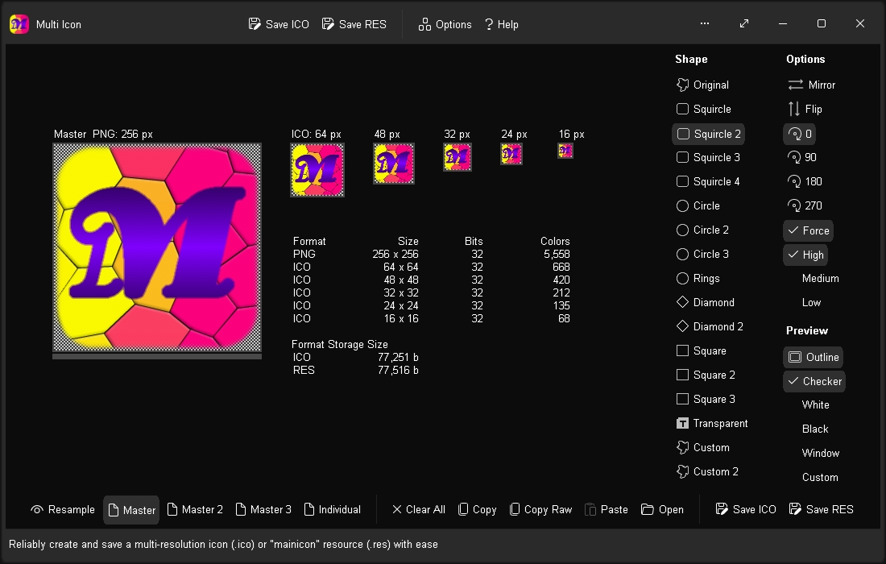
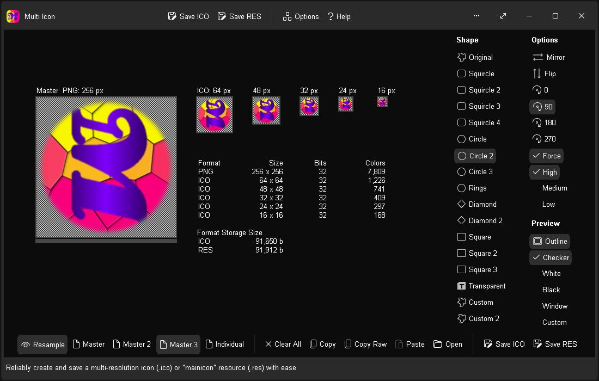
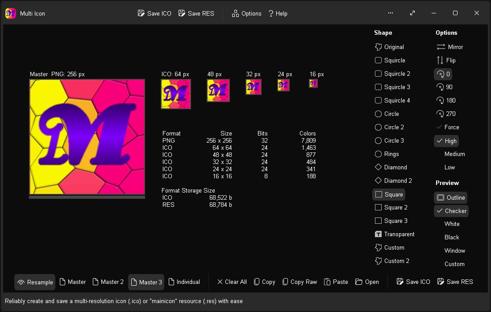
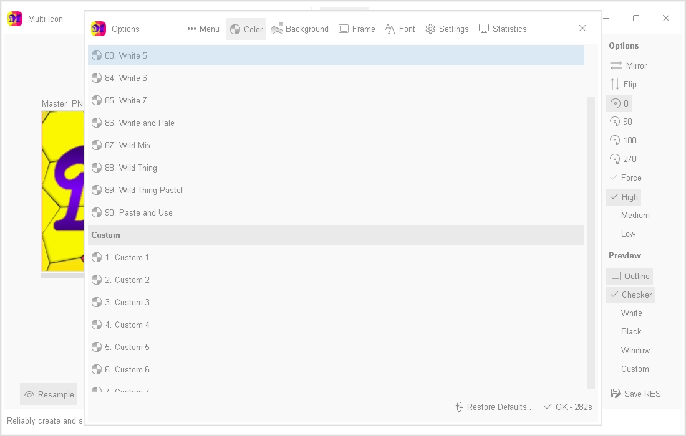

# Multi Icon v1.0.2047 / 09nov2025 / MIT License
Create stunning, high quality (256 x 256) multi-resolution icons (.ico) and "mainicon" resources (.res) with ease and reliability.  Open an image from file, or paste one in with transparency, or drag and drop an image directly onto the corresponding icon resolutions, then save.

The multi-resolution icon stores a 256 x 256 image in PNG format, and five images at 64 x 64, 48 x 48, 32 x 32, 24 x 24 and 16 x 16 in native Windows icon format for maximum compatibility, back to Windows 95.

Use a single Master image for the complete set of images, or separately individualise each image resolution for complete control over appearance.  Support for 32 bit images with 8 bit alpha mask, and built-in common mask shapes to instantly transform a basic, square image into an alpha-transparent shape with one click.

Save as a multi-resolution icon in either the standard Windows icon (.ico) format, or as a Windows resource (.res) in the "mainicon" format for direct inclusion in an app, as the app's icon.

# Features
* Realtime WYSIWYG (What You See Is What You Get) display
* Multi-resolution support: 256, 64, 48, 32, 24 and 16 px image sizes
* 13 one click mask shapes to instantly transform an image
* 2 custom mask shapes (open from file and paste from Clipboard with transparency)
* Supports Clipboard transparency (PNG and CF_DIBV5)
* Options: Flip, Mirror, Rotate 0, 90, 180 and 270
* Force: Optionally remove transparent regions from original image mask when using a shape
* Variable PNG quality: High, Medium and Low for file size tweaking
* Preview options for transparency contrast: Outline image, checkerboard pattern or solid color of white, black, window, or custom
* Master - Dynamically derive all images from the Master image (PNG 256 x 256)
* Master modes 2 and 3 soften scaling artifacts for lower resolution images (64 to 16 px) 
* Individual mode permits custom images for all 6 resolutions (256 to 16 px)
* Realtime information: Icon format, size, bits, colors, and file size for target formats ".ico" and ".res"
* Supports opening / dragging and dropping images in the following file formats: PNG, GIF, JPG, JIF, JPEG, TJ32, BMP, DIB, ICO, CUR, ANI, TEA, TGA, PPM, PGM, PBM, PNM, XBM and IMG32
* Drag and drop images between resolutions in app
* Language: Select from a list of built-in languages, or enter a custom language ID (for ".res" files)
* Straightforward, fuss-free operation
* Options Window - Easily change app color, font, and settings
* Portable
* Smart Source Code (Borland Delphi 3 and Lazarus 2)

# Download
Download <a href="src/multiicon.exe">multiicon.exe</a> or from the "<a href="bin/">bin</a>" or "<a href="src/">src</a>" folders above.

# Images

